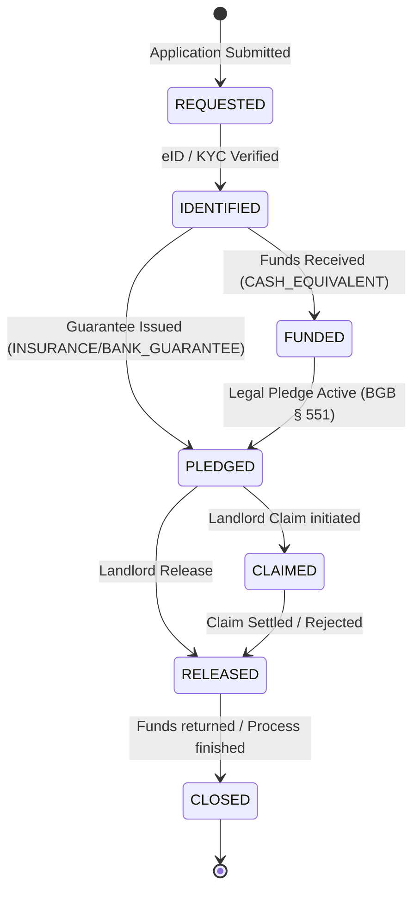

# XMiete Deposit Lifecycle State-Machine

This document defines the formal lifecycle states and transitions for a digital rental deposit within the XMiete standard.

## State Diagram

## States Definition

| State | Description | Required Data/Trigger |
| :--- | :--- | :--- |
| **REQUESTED** | Initial application. Tenant and Property data provided. | Schema validation |
| **IDENTIFIED** | Tenant identity is legally verified. | `eid_status` = `VERIFIED` |
| **FUNDED** | (For Cash) The bank account has received the full deposit amount. | Bank statement / Confirmation |
| **PLEDGED** | The deposit is legally pledged to the landlord (BGB § 551). | `is_confirmed_by_bank` = `true` |
| **RELEASED** | The landlord has officially waived their rights to the pledge. | Landlord signature/action |
| **CLAIMED** | The landlord has requested payment from the deposit. | Claim documentation |
| **CLOSED** | Finality. No more actions possible. | Completion timestamp |

## Transition Rules

1. **REQUESTED -> IDENTIFIED**: Requires successful KYC/eID.
2. **IDENTIFIED -> FUNDED**: Only applicable if `deposit.type` is `CASH_EQUIVALENT`.
3. **IDENTIFIED -> PLEDGED**: Directly possible for `INSURANCE` or `BANK_GUARANTEE` once the policy/guarantee is issued.
4. **PLEDGED -> RELEASED**: Standard end-of-tenancy flow.
5. **PLEDGED -> CLAIMED**: Dispute or damage reported by landlord.
6. **CLAIMED -> RELEASED**: After claim payout or rejection of claim.
7. **RELEASED -> CLOSED**: Final state after funds are moved back to tenant (or remaining funds).

---
**License:** Licensed under [Creative Commons Attribution 4.0 International (CC BY 4.0)](./LICENSE-SPECIFICATION).
